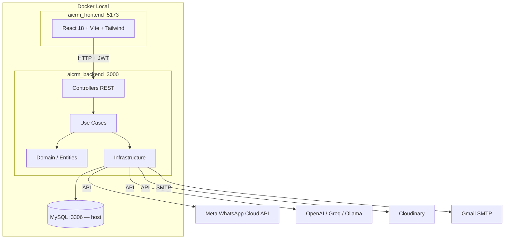

# aicrm_platform


Plataforma CRM con inteligencia artificial para pequeñas y medianas empresas (PyMEs). Permite gestionar clientes, productos, pedidos y proveedores, automatizar conversaciones de WhatsApp con un asistente de IA multi-proveedor, y obtener métricas del negocio en un panel de control.

---

## Contenido

- [Descripción del producto](#descripción-del-producto)
- [Arquitectura](#arquitectura)
- [Estructura del monorepo](#estructura-del-monorepo)
- [Funcionalidades principales](#funcionalidades-principales)
- [Requisitos](#requisitos)
- [Quick start — entorno local](#quick-start--entorno-local)
- [Quick start — Docker](#quick-start--docker)
- [Variables de entorno](#variables-de-entorno)
- [Estado de despliegue](#estado-de-despliegue)
- [Limitaciones conocidas](#limitaciones-conocidas)
- [Documentación adicional](#documentación-adicional)

---

## Descripción del producto

aicrm_platform es un CRM orientado a negocios que operan a través de WhatsApp. Integra la Meta WhatsApp Cloud API para recibir y responder mensajes de clientes de forma automática mediante un asistente conversacional con IA. El operador puede configurar el proveedor de IA (OpenAI, Groq u Ollama), y el sistema selecciona un proveedor principal con fallback automático en caso de fallo.

El panel de administración (frontend React) expone las entidades del negocio: clientes, productos, categorías, proveedores, pedidos, conversaciones y configuración de la empresa. La autenticación soporta credenciales propias (JWT + bcrypt) y Google OAuth (OIDC) tanto para operadores como para clientes finales.

---

## Arquitectura



El backend implementa arquitectura hexagonal estricta (Ports & Adapters): las entidades de dominio no tienen dependencias de framework, los puertos son interfaces puras y los adaptadores de infraestructura son los únicos que conocen NestJS, TypeORM o SDKs externos. Ver [docs/ARQUITECTURA.md](docs/ARQUITECTURA.md) para el análisis detallado.

---

## Estructura del monorepo

```
aicrm_platform/
├── aicrm_backend/          # API REST — NestJS 11 + TypeORM 0.3 + MySQL
├── aicrm_frontend/         # SPA — React 18 + TypeScript + Vite + Tailwind CSS 4
├── docs/
│   └── ARQUITECTURA.md     # Arquitectura hexagonal y decisiones de diseño
├── docker-compose.yml      # Orquestación local (MySQL debe estar en el host)
└── .github/
    └── pull_request_template.md
```

---

## Funcionalidades principales

- Autenticación JWT con bcrypt y Google OAuth (OIDC) para operadores y clientes
- Recepción y respuesta automática de mensajes WhatsApp vía Meta Cloud API
- Asistente IA multi-proveedor con selección dinámica: OpenAI (GPT-4o-mini), Groq (llama-3.3-70b-versatile), Ollama (llama3.1:8b)
- Fallback automático entre proveedores de IA con timeout configurable
- CRUD completo de productos con imágenes almacenadas en Cloudinary
- Gestión de categorías, clientes, pedidos, proveedores y conversaciones
- Dashboard con métricas del negocio (Recharts)
- Configuración de empresa con logo (subida a Cloudinary)
- Notificaciones por email vía Gmail SMTP
- Generación de recibos PDF (PDFKit)
- 19 migraciones TypeORM versionadas (sin synchronize)
- Documentación Swagger en `/api/v1/docs`

---

## Requisitos

| Herramienta | Versión mínima |
|-------------|---------------|
| Node.js | 20+ |
| npm | 9+ |
| MySQL | 8+ (corriendo en el host) |
| Docker + Docker Compose | Opcional — para levantar backend y frontend en contenedores |

Credenciales externas necesarias:

- Cuenta Meta for Developers con app de WhatsApp Business configurada
- API key de OpenAI, Groq o instalación local de Ollama (al menos una)
- Cuenta Cloudinary con un folder de productos
- Cuenta Gmail con contraseña de app para SMTP
- Credenciales de Google Cloud para OAuth (Client ID + Client Secret)

---

## Quick start — entorno local

```bash
# 1. Clonar el repositorio
git clone <repo-url>
cd aicrm_platform

# 2. Backend
cd aicrm_backend
cp .env.example .env        # Completar todas las variables requeridas
npm install
npm run migration:run       # Aplica las 19 migraciones
npm run start:dev           # Servidor en http://localhost:3000

# 3. Frontend (otra terminal)
cd ../aicrm_frontend
cp .env.example .env        # Completar VITE_API_URL y VITE_GOOGLE_LOGIN_START_URL
npm install
npm run dev                 # Vite dev server en http://localhost:5173
```

Swagger disponible en `http://localhost:3000/api/v1/docs`.

---

## Quick start — Docker

> **Advertencia:** El `docker-compose.yml` NO incluye un servicio MySQL. MySQL debe estar corriendo en el host y accesible desde los contenedores. El compose usa `host.docker.internal` para resolverlo. En Linux puede ser necesario agregar `--add-host=host.docker.internal:host-gateway`.

> **Advertencia:** El Dockerfile del frontend corre en modo desarrollo (Vite dev server), no en producción con nginx.

```bash
# Completar las variables de entorno del backend antes de levantar
cp aicrm_backend/.env.example aicrm_backend/.env
# Editar aicrm_backend/.env con los valores reales

docker compose up --build
```

- Frontend: `http://localhost:5173`
- Backend: `http://localhost:3000`
- Swagger: `http://localhost:3000/api/v1/docs`

---

## Variables de entorno

### Backend (`aicrm_backend/.env`)

#### Base de datos

| Variable | Obligatoria | Propósito | Ejemplo |
|----------|-------------|-----------|---------|
| `DB_HOST` | Sí | Host de MySQL | `localhost` |
| `DB_PORT` | No | Puerto de MySQL | `3306` |
| `DB_USERNAME` | Sí | Usuario de MySQL | `root` |
| `DB_PASSWORD` | Sí | Contraseña de MySQL | `mypassword` |
| `DB_NAME` | Sí | Nombre de la base de datos | `ai_crm` |

#### Servidor

| Variable | Obligatoria | Propósito | Ejemplo |
|----------|-------------|-----------|---------|
| `PORT` | No | Puerto del servidor NestJS | `3000` |
| `FRONTEND_URL` | Sí | URL del frontend (para CORS y redirects) | `http://localhost:5173` |

#### Auth / JWT

| Variable | Obligatoria | Propósito | Ejemplo |
|----------|-------------|-----------|---------|
| `JWT_SECRET` | Sí | Secreto para firmar tokens JWT | `una-cadena-larga-y-aleatoria` |
| `JWT_EXPIRES_IN` | No | Duración del token JWT | `1d` |

#### Google OAuth (operadores)

| Variable | Obligatoria | Propósito | Ejemplo |
|----------|-------------|-----------|---------|
| `GOOGLE_CLIENT_ID` | Sí | Client ID de Google Cloud | `123456.apps.googleusercontent.com` |
| `GOOGLE_CLIENT_SECRET` | Sí | Client Secret de Google Cloud | `GOCSPX-...` |
| `GOOGLE_OAUTH_CALLBACK_URL` | Sí | URL de callback OAuth | `http://localhost:3000/api/v1/auth/google/callback` |
| `GOOGLE_OAUTH_FAILURE_REDIRECT_URL` | Sí | Redirect en fallo de OAuth | `http://localhost:5173/auth/google/failure` |
| `GOOGLE_OAUTH_STATE_SECRET` | Sí | Secreto para validar el state OAuth | `otra-cadena-aleatoria` |
| `OAUTH_STATE_TTL_MINUTES` | No | TTL del state OAuth (operadores) | `10` |
| `CUSTOMER_OAUTH_STATE_TTL_MINUTES` | No | TTL del state OAuth (clientes) | `10` |

#### WhatsApp / Meta

| Variable | Obligatoria | Propósito | Ejemplo |
|----------|-------------|-----------|---------|
| `INTERNAL_API_KEY` | Sí | Clave interna para endpoints protegidos | `mi-api-key` |
| `META_GRAPH_API_VERSION` | Sí | Versión de la Graph API | `v19.0` |
| `META_VERIFY_TOKEN` | Sí | Token de verificación del webhook | `mi-verify-token` |
| `META_APP_SECRET` | Sí | App Secret de la app Meta | `abc123...` |
| `WHATSAPP_WEBHOOK_VALIDATE_SIGNATURE` | No | Validar firma HMAC del webhook | `false` |

#### Proveedores de IA

| Variable | Obligatoria | Propósito | Ejemplo |
|----------|-------------|-----------|---------|
| `AI_PROVIDER_PRIMARY` | No | Proveedor principal de IA | `openai` |
| `AI_PROVIDER_FALLBACK` | No | Proveedor de fallback | `groq` |
| `AI_PROVIDER_TIMEOUT_MS` | No | Timeout por request de IA (ms) | `30000` |
| `AI_PROVIDER_MAX_RETRIES` | No | Reintentos máximos por proveedor | `1` |
| `AI_JSON_STRICT` | No | Validar JSON estricto en respuestas IA | `true` |
| `OPENAI_API_KEY` | Condicional | API key de OpenAI | `sk-...` |
| `OPENAI_MODEL` | No | Modelo de OpenAI a usar | `gpt-4o-mini` |
| `GROQ_API_KEY` | Condicional | API key de Groq | `gsk_...` |
| `GROQ_BASE_URL` | No | Base URL de la API Groq | `https://api.groq.com/openai/v1` |
| `GROQ_MODEL` | No | Modelo de Groq a usar | `llama-3.3-70b-versatile` |
| `OLLAMA_BASE_URL` | Condicional | Base URL de Ollama local | `http://localhost:11434/v1` |
| `OLLAMA_MODEL` | No | Modelo de Ollama a usar | `llama3.1:8b` |
| `OLLAMA_API_KEY` | No | Clave para Ollama (normalmente fija) | `ollama` |

#### Cloudinary

| Variable | Obligatoria | Propósito | Ejemplo |
|----------|-------------|-----------|---------|
| `CLOUDINARY_CLOUD_NAME` | Sí | Nombre del cloud Cloudinary | `mi-cloud` |
| `CLOUDINARY_API_KEY` | Sí | API key de Cloudinary | `123456789012345` |
| `CLOUDINARY_API_SECRET` | Sí | API secret de Cloudinary | `abcDEF...` |
| `CLOUDINARY_FOLDER_PRODUCTS` | Sí | Carpeta de imágenes de productos | `aicrm/products` |

#### Email SMTP

| Variable | Obligatoria | Propósito | Ejemplo |
|----------|-------------|-----------|---------|
| `SMTP_HOST` | Sí | Host del servidor SMTP | `smtp.gmail.com` |
| `SMTP_PORT` | No | Puerto SMTP | `587` |
| `SMTP_SECURE` | No | Usar TLS desde el inicio | `false` |
| `SMTP_USER` | Sí | Usuario SMTP (email) | `mi@gmail.com` |
| `SMTP_PASS` | Sí | Contraseña de app Gmail | `abcd efgh ijkl mnop` |
| `SMTP_FROM` | Sí | Dirección remitente | `mi@gmail.com` |

### Frontend (`aicrm_frontend/.env`)

| Variable | Obligatoria | Propósito | Ejemplo |
|----------|-------------|-----------|---------|
| `VITE_API_URL` | Sí | URL base de la API backend | `http://localhost:3000/api/v1` |
| `VITE_GOOGLE_LOGIN_START_URL` | Sí | URL para iniciar Google OAuth | `http://localhost:3000/api/v1/auth/google/start` |

---

## Estado de despliegue

Este proyecto corrió en entorno Docker local durante su desarrollo. **No tiene deploy público activo.** No existe infraestructura en cloud ni pipeline de CI/CD configurado.

---

## Limitaciones conocidas

1. **Sin deploy público** — el proyecto corrió exclusivamente en Docker local.
2. **Frontend en modo desarrollo** — el Dockerfile del frontend usa el Vite dev server, no una build de producción con nginx.
3. **MySQL no está en el compose** — `docker-compose.yml` no levanta MySQL; requiere una instancia corriendo en el host.
4. **Sin CI/CD** — no existe el directorio `.github/workflows/`.
5. **Payment provider es mock** — `MockPaymentProvider` no procesa pagos reales.
6. **OAuth store en memoria** — `InMemoryOauthTempStoreAdapter` pierde el estado en cada restart y no es apto para múltiples instancias.
7. **Credenciales WhatsApp sin cifrar** — `accessToken` y `appSecret` de WhatsApp se almacenan en texto plano en la base de datos.
8. **JWT_SECRET con default inseguro** — el código tiene un valor por defecto (`supersecretkey`) que debe ser reemplazado obligatoriamente en cualquier entorno real.
9. **Cobertura de tests parcial** — existen tests unitarios en use-cases; el test e2e es un placeholder.
10. **Frontend `.env` commiteado** — el archivo `.env` del frontend está incluido en el repositorio.

---

## Documentación adicional

- [aicrm_backend/README.md](aicrm_backend/README.md) — Setup, endpoints, migraciones y ENV vars del backend
- [aicrm_frontend/README.md](aicrm_frontend/README.md) — Setup, rutas y flujo de auth del frontend
- [docs/ARQUITECTURA.md](docs/ARQUITECTURA.md) — Arquitectura hexagonal, flujo WhatsApp-IA-DB y decisiones de diseño
