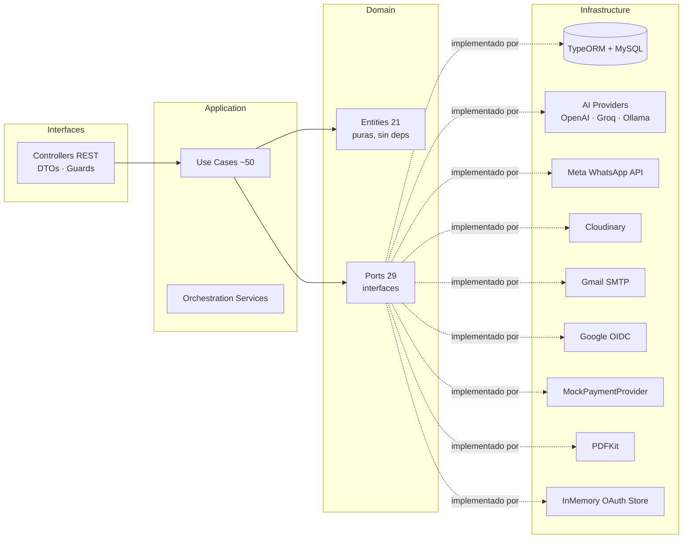

# aicrm_backend

API REST del CRM construida con NestJS 11, TypeORM 0.3 y MySQL 8. Implementa arquitectura hexagonal estricta (Ports & Adapters): las entidades de dominio son clases TypeScript puras sin dependencias de framework, los puertos son interfaces que definen contratos, y los adaptadores de infraestructura son los únicos módulos que conocen NestJS, TypeORM o SDKs de terceros.

El servicio expone endpoints REST bajo el prefijo global `api/v1`, documenta su superficie con Swagger y corre en el puerto 3000 por defecto.

---

## Contenido

- [Arquitectura de capas](#arquitectura-de-capas)
- [Modelo de dominio](#modelo-de-dominio)
- [API — Endpoints por módulo](#api--endpoints-por-módulo)
- [Integraciones externas](#integraciones-externas)
- [Prompts del asistente IA](#prompts-del-asistente-ia)
- [Setup local](#setup-local)
- [Migraciones TypeORM](#migraciones-typeorm)
- [Tests](#tests)
- [Variables de entorno](#variables-de-entorno)
- [Swagger](#swagger)
- [Limitaciones conocidas](#limitaciones-conocidas)

---

## Arquitectura de capas



La regla fundamental: las capas internas (Domain, Application) no importan nada de las capas externas. La dependencia siempre apunta hacia adentro.

---

## Modelo de dominio

21 entidades puras en `src/domain/entities/`. Ninguna depende de NestJS, TypeORM ni ningún SDK externo.

| Entidad | Responsabilidad |
|---------|----------------|
| `Company` | Datos de la empresa que usa el CRM (nombre, logo, configuración) |
| `User` | Operador del CRM con rol y credenciales |
| `Customer` | Cliente final del negocio |
| `Product` | Producto del catálogo con precio, stock e imagen |
| `Category` | Categoría de productos con estado activo/inactivo |
| `Conversation` | Hilo de conversación de WhatsApp asociado a un cliente |
| `ConversationState` | Estado actual de una conversación (activa, cerrada, etc.) |
| `Message` | Mensaje individual dentro de una conversación |
| `Order` | Pedido realizado por un cliente |
| `OrderItem` | Línea de producto dentro de un pedido |
| `CartSession` | Sesión de carrito de compras en curso |
| `CartItem` | Producto dentro de un carrito |
| `CompanyWhatsappApp` | Configuración de la app Meta de la empresa |
| `CompanyWhatsappCredential` | Credenciales de acceso a la Meta Graph API |
| `ExternalIdentity` | Identidad externa vinculada a un usuario |
| `OauthIdentity` | Identidad OAuth de un operador |
| `OauthRegistrationSession` | Sesión temporal durante el registro OAuth de un operador |
| `CustomerOauthIdentity` | Identidad OAuth de un cliente |
| `CustomerOauthLinkSession` | Sesión temporal para vincular OAuth a una cuenta de cliente |
| `Supplier` | Proveedor de productos con estado activo/inactivo |
| `PaymentTransaction` | Registro de una transacción de pago |

---

## API — Endpoints por módulo

| Módulo | Método | Path | Descripción | Auth |
|--------|--------|------|-------------|------|
| Auth | POST | `/api/v1/auth/register` | Registro de operador con email/password | No |
| Auth | POST | `/api/v1/auth/login` | Login con email/password, retorna JWT | No |
| Auth | GET | `/api/v1/auth/google/start` | Inicia flujo OAuth Google (operador) | No |
| Auth | GET | `/api/v1/auth/google/callback` | Callback OAuth Google (operador) | No |
| Auth | POST | `/api/v1/auth/google/exchange` | Intercambia código por token | No |
| Auth | POST | `/api/v1/auth/google/complete-registration` | Completa registro con datos faltantes | No |
| Auth | GET | `/api/v1/auth/customers/google/start` | Inicia OAuth Google para clientes | No |
| Auth | GET | `/api/v1/auth/customers/google/callback` | Callback OAuth Google para clientes | No |
| Products | GET | `/api/v1/products` | Lista todos los productos | JWT |
| Products | POST | `/api/v1/products` | Crea producto (sin imagen) | JWT |
| Products | PATCH | `/api/v1/products/:id` | Actualiza datos del producto | JWT |
| Products | POST | `/api/v1/products/with-image` | Crea producto con imagen (Cloudinary) | JWT |
| Products | PATCH | `/api/v1/products/:id/with-image` | Actualiza producto con imagen | JWT |
| Products | GET | `/api/v1/products/:id/suppliers` | Lista proveedores de un producto | JWT |
| Categories | GET | `/api/v1/categories` | Lista todas las categorías | JWT |
| Categories | POST | `/api/v1/categories` | Crea categoría | JWT |
| Categories | PATCH | `/api/v1/categories/:id/status` | Cambia estado activo/inactivo | JWT |
| Categories | GET | `/api/v1/categories/active` | Lista categorías activas | JWT |
| Categories | GET | `/api/v1/categories/:id/products` | Lista productos de una categoría | JWT |
| Customers | GET | `/api/v1/customers` | Lista clientes | JWT |
| Customers | POST | `/api/v1/customers` | Crea cliente | JWT |
| Conversations | GET | `/api/v1/conversations` | Lista conversaciones | JWT |
| Conversations | POST | `/api/v1/conversations` | Crea conversación | JWT |
| Conversations | GET | `/api/v1/conversations/:id/messages` | Mensajes de una conversación | JWT |
| Messages | GET | `/api/v1/messages` | Lista mensajes | JWT |
| Messages | POST | `/api/v1/messages` | Crea mensaje | JWT |
| Orders | GET | `/api/v1/orders` | Lista pedidos | JWT |
| Orders | POST | `/api/v1/orders` | Crea pedido | JWT |
| Company | GET | `/api/v1/company/settings` | Obtiene configuración de la empresa | JWT |
| Company | PATCH | `/api/v1/company/settings` | Actualiza configuración de la empresa | JWT |
| Company | PATCH | `/api/v1/company/settings/logo` | Actualiza logo (Cloudinary) | JWT |
| Webhooks | GET | `/api/v1/webhooks/whatsapp` | Verificación del webhook Meta | No |
| Webhooks | POST | `/api/v1/webhooks/whatsapp` | Recibe eventos de WhatsApp | No (HMAC) |
| WhatsApp Config | POST | `/api/v1/company-whatsapp-apps` | Registra app WhatsApp de la empresa | JWT |
| WhatsApp Config | POST | `/api/v1/company-whatsapp-credentials` | Registra credenciales WhatsApp | JWT |
| Suppliers | GET | `/api/v1/suppliers` | Lista proveedores | JWT |
| Suppliers | POST | `/api/v1/suppliers` | Crea proveedor | JWT |
| Suppliers | PATCH | `/api/v1/suppliers/:id` | Actualiza proveedor | JWT |
| Suppliers | PATCH | `/api/v1/suppliers/:id/status` | Cambia estado del proveedor | JWT |
| Suppliers | GET | `/api/v1/suppliers/:id` | Obtiene proveedor por ID | JWT |
| Suppliers | GET | `/api/v1/suppliers/:id/products` | Lista productos de un proveedor | JWT |
| Swagger | GET | `/api/v1/docs` | Documentación OpenAPI interactiva | No |

---

## Integraciones externas

| Servicio | Adaptador | Variables de entorno principales | Propósito |
|----------|-----------|----------------------------------|-----------|
| MySQL | TypeORM (21 repos) | `DB_HOST`, `DB_PORT`, `DB_NAME` | Persistencia principal |
| OpenAI | `OpenAIProvider` | `OPENAI_API_KEY`, `OPENAI_MODEL` | Proveedor de IA primario (LLM) |
| Groq | `GroqProvider` | `GROQ_API_KEY`, `GROQ_MODEL` | Proveedor de IA alternativo (LLM) |
| Ollama | `OllamaProvider` | `OLLAMA_BASE_URL`, `OLLAMA_MODEL` | Proveedor de IA offline local |
| Meta WhatsApp Cloud API | `MetaWhatsappService` | `META_GRAPH_API_VERSION`, `META_VERIFY_TOKEN` | Envío/recepción de mensajes WhatsApp |
| Cloudinary | `CloudinaryImageStorageService` | `CLOUDINARY_CLOUD_NAME`, `CLOUDINARY_API_KEY` | Almacenamiento de imágenes |
| Gmail SMTP | `GmailSmtpEmailSender` | `SMTP_HOST`, `SMTP_USER`, `SMTP_PASS` | Envío de emails transaccionales |
| Google OIDC | `GoogleOidcAdapter` | `GOOGLE_CLIENT_ID`, `GOOGLE_CLIENT_SECRET` | Autenticación OAuth con Google |
| PDFKit | `PdfkitReceiptGenerator` | — | Generación de recibos en PDF |
| MockPaymentProvider | `MockPaymentProvider` | — | Simulación de pagos (no real) |
| InMemory OAuth Store | `InMemoryOauthTempStoreAdapter` | `OAUTH_STATE_TTL_MINUTES` | Estado temporal de flujos OAuth |

---

## Prompts del asistente IA

El directorio `prompts/` contiene los prompts del sistema que usa el asistente conversacional. Estos prompts definen el comportamiento del agente de IA cuando responde mensajes de clientes a través de WhatsApp y determinan el tono, el alcance de respuestas y las restricciones del asistente.

---

## Setup local

```bash
# Desde la raíz del monorepo
cd aicrm_backend

# Instalar dependencias
npm install

# Configurar variables de entorno
cp .env.example .env
# Editar .env con los valores reales

# Aplicar migraciones (requiere MySQL corriendo)
npm run migration:run

# Modo desarrollo con hot-reload
npm run start:dev

# Build de producción
npm run build
npm run start:prod
```

---

## Migraciones TypeORM

El proyecto usa migraciones explícitas. La opción `synchronize` está desactivada en producción. Hay 19 migraciones en `src/infrastructure/database/migrations/`, numeradas por timestamp desde `1710000000000`.

| # | Nombre |
|---|--------|
| 0 | InitialCrmSchema |
| 1 | AddConversationStateTable |
| 2 | AddCartSessionAndCartItem |
| 3 | AddExternalIdentity |
| 4 | AddOauthIdentityAndRegistrationSession |
| 5 | AddCompanyWhatsappApp |
| 6 | AddCompanyWhatsappCredentials |
| 7 | AddCustomerOauthIdentity |
| 8 | AddCustomerOauthLinkSession |
| 9 | AddSupplierTable |
| 10 | AddProductSupplierRelation |
| 11 | AddPaymentTransaction |
| 12 — 18 | Migraciones incrementales hasta AddCompanyBrandingLogo |

```bash
# Aplicar todas las migraciones pendientes
npm run migration:run

# Revertir la última migración
npm run migration:revert

# Generar una nueva migración a partir de cambios en entidades ORM
npm run migration:generate -- -n NombreDeLaMigracion
```

---

## Tests

```bash
# Tests unitarios (Jest)
npm run test

# Tests con modo watch
npm run test:watch

# Cobertura
npm run test:cov

# Tests e2e
npm run test:e2e
```

Estado actual de la cobertura:

- Tests unitarios implementados en los use-cases de la capa de aplicación.
- El archivo de test e2e (`test/app.e2e-spec.ts`) es un placeholder y no cubre flujos reales.
- No hay tests de integración contra la base de datos.

---

## Variables de entorno

### Base de datos

| Variable | Obligatoria | Propósito | Valor por defecto |
|----------|-------------|-----------|-------------------|
| `DB_HOST` | Sí | Host de MySQL | — |
| `DB_PORT` | No | Puerto de MySQL | `3306` |
| `DB_USERNAME` | Sí | Usuario de MySQL | `root` |
| `DB_PASSWORD` | Sí | Contraseña de MySQL | — |
| `DB_NAME` | Sí | Nombre de la base de datos | `ai_crm` |

### Servidor

| Variable | Obligatoria | Propósito | Valor por defecto |
|----------|-------------|-----------|-------------------|
| `PORT` | No | Puerto del servidor | `3000` |
| `FRONTEND_URL` | Sí | URL del frontend (CORS + redirects) | `http://localhost:5173` |

### Auth / JWT

| Variable | Obligatoria | Propósito | Valor por defecto |
|----------|-------------|-----------|-------------------|
| `JWT_SECRET` | Sí | Secreto para firmar tokens JWT | `supersecretkey` (INSEGURO — cambiar) |
| `JWT_EXPIRES_IN` | No | Duración del token | `1d` |

### Google OAuth (operadores)

| Variable | Obligatoria | Propósito | Valor por defecto |
|----------|-------------|-----------|-------------------|
| `GOOGLE_CLIENT_ID` | Sí | Client ID de Google Cloud | — |
| `GOOGLE_CLIENT_SECRET` | Sí | Client Secret de Google Cloud | — |
| `GOOGLE_OAUTH_CALLBACK_URL` | Sí | URL de callback OAuth | — |
| `GOOGLE_OAUTH_FAILURE_REDIRECT_URL` | Sí | Redirect en fallo de OAuth | — |
| `GOOGLE_OAUTH_STATE_SECRET` | Sí | Secreto para validar el state | — |
| `OAUTH_STATE_TTL_MINUTES` | No | TTL del state OAuth (operadores) | `10` |
| `CUSTOMER_OAUTH_STATE_TTL_MINUTES` | No | TTL del state OAuth (clientes) | `10` |

### WhatsApp / Meta

| Variable | Obligatoria | Propósito | Valor por defecto |
|----------|-------------|-----------|-------------------|
| `INTERNAL_API_KEY` | Sí | Clave interna para endpoints protegidos | — |
| `META_GRAPH_API_VERSION` | Sí | Versión de la Graph API | — |
| `META_VERIFY_TOKEN` | Sí | Token de verificación del webhook | — |
| `META_APP_SECRET` | Sí | App Secret de la app Meta | — |
| `WHATSAPP_WEBHOOK_VALIDATE_SIGNATURE` | No | Validar firma HMAC del webhook | `false` |

### Proveedores de IA

| Variable | Obligatoria | Propósito | Valor por defecto |
|----------|-------------|-----------|-------------------|
| `AI_PROVIDER_PRIMARY` | No | Proveedor principal | `openai` |
| `AI_PROVIDER_FALLBACK` | No | Proveedor de fallback | `none` |
| `AI_PROVIDER_TIMEOUT_MS` | No | Timeout por request (ms) | `30000` |
| `AI_PROVIDER_MAX_RETRIES` | No | Reintentos máximos | `1` |
| `AI_JSON_STRICT` | No | Validar JSON en respuestas IA | `true` |
| `OPENAI_API_KEY` | Condicional | API key de OpenAI | — |
| `OPENAI_MODEL` | No | Modelo de OpenAI | `gpt-4o-mini` |
| `GROQ_API_KEY` | Condicional | API key de Groq | — |
| `GROQ_BASE_URL` | No | Base URL de Groq | `https://api.groq.com/openai/v1` |
| `GROQ_MODEL` | No | Modelo de Groq | `llama-3.3-70b-versatile` |
| `OLLAMA_BASE_URL` | Condicional | Base URL de Ollama | `http://localhost:11434/v1` |
| `OLLAMA_MODEL` | No | Modelo de Ollama | `llama3.1:8b` |
| `OLLAMA_API_KEY` | No | API key de Ollama | `ollama` |

### Cloudinary

| Variable | Obligatoria | Propósito | Valor por defecto |
|----------|-------------|-----------|-------------------|
| `CLOUDINARY_CLOUD_NAME` | Sí | Nombre del cloud | — |
| `CLOUDINARY_API_KEY` | Sí | API key | — |
| `CLOUDINARY_API_SECRET` | Sí | API secret | — |
| `CLOUDINARY_FOLDER_PRODUCTS` | Sí | Carpeta de imágenes de productos | — |

### Email SMTP

| Variable | Obligatoria | Propósito | Valor por defecto |
|----------|-------------|-----------|-------------------|
| `SMTP_HOST` | Sí | Host SMTP | `smtp.gmail.com` |
| `SMTP_PORT` | No | Puerto SMTP | `587` |
| `SMTP_SECURE` | No | TLS desde el inicio | `false` |
| `SMTP_USER` | Sí | Usuario (email) | — |
| `SMTP_PASS` | Sí | Contraseña de app Gmail | — |
| `SMTP_FROM` | Sí | Dirección remitente | — |

---

## Swagger

La documentación interactiva de la API está disponible en `http://localhost:3000/api/v1/docs` cuando el servidor está corriendo. Incluye todos los endpoints, esquemas de request/response y soporte para autenticación Bearer (JWT).

---

## Limitaciones conocidas

- `JWT_SECRET` tiene un valor por defecto inseguro en el código. Siempre definir esta variable explícitamente.
- `InMemoryOauthTempStoreAdapter` no persiste entre reinicios y no soporta múltiples instancias del servidor.
- Las credenciales de WhatsApp (`accessToken`, `appSecret`) se almacenan en texto plano en la base de datos.
- `MockPaymentProvider` no procesa pagos reales.
- La validación de firma HMAC del webhook de WhatsApp está desactivada por defecto (`WHATSAPP_WEBHOOK_VALIDATE_SIGNATURE=false`).
- La cobertura de tests es parcial — el test e2e es un placeholder.
