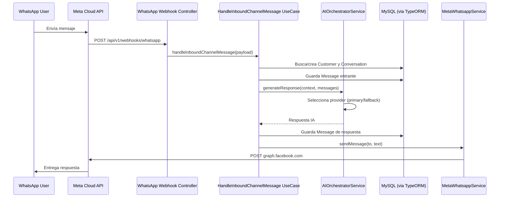

# Arquitectura — aicrm_platform

Este documento describe las decisiones de diseño arquitectónico del sistema, el modelo de capas hexagonales implementado en el backend, el flujo completo de mensajes WhatsApp a través del sistema, y la estrategia multi-proveedor de IA.

---

## Contenido

- [Arquitectura hexagonal](#arquitectura-hexagonal)
- [Tabla de puertos y adaptadores](#tabla-de-puertos-y-adaptadores)
- [Flujo completo WhatsApp → IA → DB](#flujo-completo-whatsapp--ia--db)
- [Estrategia multi-proveedor de IA](#estrategia-multi-proveedor-de-ia)
- [Consideraciones de seguridad](#consideraciones-de-seguridad)
- [Decisiones de diseño](#decisiones-de-diseño)

---

## Arquitectura hexagonal

### Qué es

La arquitectura hexagonal (Ports & Adapters, Alistair Cockburn, 2005) organiza una aplicación en tres zonas concéntricas:

1. **Domain** — el núcleo. Contiene entidades y reglas de negocio puras. No depende de ningún framework, ORM ni SDK externo. En este proyecto: 21 entidades en `src/domain/entities/` y 29 interfaces de puertos en `src/domain/ports/`.

2. **Application** — los casos de uso. Orquesta las entidades de dominio y llama a los puertos para interactuar con el mundo externo. Tampoco depende de NestJS ni de infraestructura concreta. En este proyecto: ~50 use-cases en `src/application/use-cases/` y 4 servicios de orquestación en `src/application/services/`.

3. **Infrastructure / Interfaces** — los adaptadores. Son los únicos módulos que conocen NestJS, TypeORM, los SDKs de OpenAI, Meta, Cloudinary, etc. Implementan los puertos definidos en el dominio e inyectan esas implementaciones vía el sistema de módulos de NestJS.

### Por qué se usó

La arquitectura hexagonal permite:

- **Testabilidad** — los use-cases pueden testearse con mocks de los puertos sin levantar base de datos ni servicios externos.
- **Reemplazabilidad** — cambiar de MySQL a PostgreSQL, de OpenAI a Anthropic, o de Gmail SMTP a SendGrid implica escribir un nuevo adaptador que implemente el puerto existente, sin tocar el dominio ni los use-cases.
- **Separación de responsabilidades explícita** — el dominio no sabe qué base de datos existe; los use-cases no saben qué proveedor de IA está configurado.

### Cómo está implementada

```
src/
├── domain/
│   ├── entities/         # 21 clases TypeScript puras
│   └── ports/            # 29 interfaces TypeScript
├── application/
│   ├── use-cases/        # ~50 use-cases, uno por operación de negocio
│   └── services/         # 4 servicios de orquestación
├── infrastructure/
│   ├── ai/               # OpenAIProvider, GroqProvider, OllamaProvider + AIOrchestratorService
│   ├── database/         # TypeORM entities, migrations, repositories (adaptadores de repos)
│   ├── email/            # GmailSmtpEmailSender
│   ├── external-services/cloudinary/   # CloudinaryImageStorageService
│   ├── oauth/            # GoogleOidcAdapter
│   ├── payments/         # MockPaymentProvider
│   ├── pdf/              # PdfkitReceiptGenerator
│   ├── security/         # InMemoryOauthTempStoreAdapter
│   └── whatsapp/         # MetaWhatsappService
└── interfaces/
    └── http/
        ├── controllers/  # 14 controladores REST
        ├── dtos/         # 17 DTOs con class-validator
        └── guards/       # JWT guard + CurrentUser decorator
```

La regla de dependencia es estricta: `infrastructure` y `interfaces` pueden importar de `domain` y `application`, pero nunca al revés.

---

## Tabla de puertos y adaptadores

Cada puerto es una interfaz en `src/domain/ports/`. Cada adaptador es una clase en `src/infrastructure/` que implementa esa interfaz y es registrada en el módulo NestJS correspondiente.

### Puertos de repositorio (21)

| Puerto | Adaptador | Propósito |
|--------|-----------|-----------|
| `ICompanyRepository` | `TypeOrmCompanyRepository` | CRUD de empresas |
| `IUserRepository` | `TypeOrmUserRepository` | CRUD de operadores |
| `ICustomerRepository` | `TypeOrmCustomerRepository` | CRUD de clientes |
| `IProductRepository` | `TypeOrmProductRepository` | CRUD de productos |
| `ICategoryRepository` | `TypeOrmCategoryRepository` | CRUD de categorías |
| `IConversationRepository` | `TypeOrmConversationRepository` | CRUD de conversaciones |
| `IConversationStateRepository` | `TypeOrmConversationStateRepository` | Estados de conversaciones |
| `IMessageRepository` | `TypeOrmMessageRepository` | CRUD de mensajes |
| `IOrderRepository` | `TypeOrmOrderRepository` | CRUD de pedidos |
| `IOrderItemRepository` | `TypeOrmOrderItemRepository` | Líneas de pedidos |
| `ICartSessionRepository` | `TypeOrmCartSessionRepository` | Sesiones de carrito |
| `ICartItemRepository` | `TypeOrmCartItemRepository` | Items de carrito |
| `ICompanyWhatsappAppRepository` | `TypeOrmCompanyWhatsappAppRepository` | Apps WhatsApp de la empresa |
| `ICompanyWhatsappCredentialRepository` | `TypeOrmCompanyWhatsappCredentialRepository` | Credenciales WhatsApp |
| `IExternalIdentityRepository` | `TypeOrmExternalIdentityRepository` | Identidades externas |
| `IOauthIdentityRepository` | `TypeOrmOauthIdentityRepository` | Identidades OAuth de operadores |
| `IOauthRegistrationSessionRepository` | `TypeOrmOauthRegistrationSessionRepository` | Sesiones de registro OAuth |
| `ICustomerOauthIdentityRepository` | `TypeOrmCustomerOauthIdentityRepository` | Identidades OAuth de clientes |
| `ICustomerOauthLinkSessionRepository` | `TypeOrmCustomerOauthLinkSessionRepository` | Sesiones de vinculación OAuth |
| `ISupplierRepository` | `TypeOrmSupplierRepository` | CRUD de proveedores |
| `IPaymentTransactionRepository` | `TypeOrmPaymentTransactionRepository` | Transacciones de pago |

### Puertos de servicios externos (8)

| Puerto | Adaptador | Propósito |
|--------|-----------|-----------|
| `AIService` | `AIOrchestratorService` | Generación de respuestas con LLM (multi-proveedor) |
| `IEmailSender` | `GmailSmtpEmailSender` | Envío de emails transaccionales |
| `IGoogleOidcProvider` | `GoogleOidcAdapter` | Validación de tokens Google OIDC |
| `IImageStorage` | `CloudinaryImageStorageService` | Subida y gestión de imágenes |
| `IOauthTempStore` | `InMemoryOauthTempStoreAdapter` | Almacenamiento temporal de state OAuth |
| `IPaymentProvider` | `MockPaymentProvider` | Procesamiento de pagos (mock) |
| `IPdfReceiptGenerator` | `PdfkitReceiptGenerator` | Generación de recibos PDF |
| `IWhatsappMessageSender` | `MetaWhatsappService` | Envío de mensajes por WhatsApp Cloud API |

---

## Flujo completo WhatsApp → IA → DB

El siguiente diagrama muestra el recorrido de un mensaje entrante de WhatsApp desde que el usuario lo envía hasta que el sistema responde:



### Detalles del flujo

1. **Verificación del webhook** — Meta primero realiza un `GET /api/v1/webhooks/whatsapp` con un `hub.verify_token` para validar la propiedad del endpoint. El backend compara el token con `META_VERIFY_TOKEN` y responde con el `hub.challenge`.

2. **Recepción del evento** — El `POST /api/v1/webhooks/whatsapp` recibe el payload de Meta. Opcionalmente valida la firma HMAC-SHA256 con `META_APP_SECRET` si `WHATSAPP_WEBHOOK_VALIDATE_SIGNATURE=true`.

3. **Use case de orquestación** — El `HandleInboundChannelMessage` use-case concentra toda la lógica de negocio: identifica o crea al cliente, asocia o crea la conversación, persiste el mensaje entrante, llama al servicio de IA y persiste la respuesta.

4. **Selección de proveedor IA** — `AIOrchestratorService` delega al proveedor configurado en `AI_PROVIDER_PRIMARY`. Si falla (timeout o error), y existe un `AI_PROVIDER_FALLBACK`, lo intenta con el proveedor de respaldo.

5. **Respuesta al usuario** — `MetaWhatsappService` llama a la Meta Graph API (`graph.facebook.com`) con el número destino y el texto de la respuesta.

---

## Estrategia multi-proveedor de IA

### Diseño

El sistema de IA sigue el mismo patrón hexagonal que el resto del backend:

```
domain/ports/
└── ai.service.port.ts          # Puerto: interfaz IAIService

infrastructure/ai/
├── ai-orchestrator.service.ts  # Adaptador principal: selección y fallback
├── ai-provider.resolver.ts     # Resuelve qué proveedor instanciar según config
├── providers/
│   ├── openai.provider.ts      # Implementa IAIService vía OpenAI SDK
│   ├── groq.provider.ts        # Implementa IAIService vía Groq (compatible OpenAI)
│   └── ollama.provider.ts      # Implementa IAIService vía Ollama (compatible OpenAI)
└── base/
    ├── ai-errors.ts            # Tipos de error normalizados
    ├── ai-json-validator.ts    # Valida que la respuesta IA sea JSON válido
    ├── prompt-builder.ts       # Construye el prompt del sistema con el contexto
    └── response-normalizer.ts  # Normaliza la respuesta de cada provider al formato interno
```

### Flujo de selección de proveedor

1. `AIOrchestratorService` lee `AI_PROVIDER_PRIMARY` al iniciar (ej: `openai`).
2. `ai-provider.resolver.ts` instancia el provider concreto correspondiente.
3. Al recibir un pedido de generación, el orquestador llama al provider primario con un timeout de `AI_PROVIDER_TIMEOUT_MS`.
4. Si el provider primario falla (timeout, error de red, error de la API), y `AI_PROVIDER_FALLBACK` no es `none`, el orquestador repite con el provider de fallback.
5. Si ambos fallan, el use-case recibe el error y puede decidir enviar un mensaje de disculpa al usuario.

### Proveedores disponibles

| Provider | Variable config | Modelo por defecto | Notas |
|----------|----------------|-------------------|-------|
| OpenAI | `AI_PROVIDER_PRIMARY=openai` | `gpt-4o-mini` | Testeado en producción |
| Groq | `AI_PROVIDER_PRIMARY=groq` | `llama-3.3-70b-versatile` | Testeado en producción — alta velocidad de inferencia |
| Ollama | `AI_PROVIDER_PRIMARY=ollama` | `llama3.1:8b` | Para entornos offline o sin API key |

### Infraestructura compartida (base/)

- **`prompt-builder.ts`** — Construye el prompt del sistema inyectando el contexto de la conversación (historial de mensajes, datos del cliente, catálogo de productos disponibles). Los prompts base se definen en el directorio `prompts/` del proyecto.
- **`response-normalizer.ts`** — Convierte la respuesta de cada provider (que varía en estructura) a un formato interno unificado que el use-case puede consumir.
- **`ai-json-validator.ts`** — Cuando `AI_JSON_STRICT=true`, valida que la respuesta del LLM sea JSON parseable antes de procesarla.
- **`ai-errors.ts`** — Define tipos de error específicos del dominio de IA (`AITimeoutError`, `AIProviderError`, `AIJsonValidationError`) para que el use-case pueda tomar decisiones basadas en el tipo de fallo.

---

## Consideraciones de seguridad

### Lo que existe

- Autenticación con JWT firmado (HS256) — todos los endpoints protegidos requieren `Authorization: Bearer <token>`.
- Hash de contraseñas con bcrypt.
- Google OIDC para autenticación sin contraseña.
- Validación de payload con class-validator en todos los DTOs.
- Soporte para validación de firma HMAC-SHA256 en el webhook de WhatsApp (`WHATSAPP_WEBHOOK_VALIDATE_SIGNATURE`).
- TTL configurable para el state de flujos OAuth (`OAUTH_STATE_TTL_MINUTES`).

### Limitaciones conocidas

- **`JWT_SECRET` con default inseguro** — el código tiene el valor `supersecretkey` como fallback. Si no se define la variable de entorno, cualquier instancia usará ese secreto predecible.
- **Credenciales WhatsApp sin cifrar** — `accessToken` y `appSecret` de la Meta Graph API se almacenan en texto plano en la tabla de credenciales de la base de datos.
- **`InMemoryOauthTempStoreAdapter`** — el state temporal de los flujos OAuth se guarda en memoria del proceso. Se pierde en cada restart y no funciona con múltiples instancias del servidor (ej: detrás de un load balancer).
- **HMAC desactivado por defecto** — `WHATSAPP_WEBHOOK_VALIDATE_SIGNATURE=false` significa que cualquier request al endpoint del webhook es procesado sin verificar su origen.
- **JWT en `localStorage`** (frontend) — expone el token a ataques XSS. Las cookies `HttpOnly` son más seguras para producción.
- **Sin rate limiting** — no existe middleware de rate limiting en los endpoints de autenticación ni en el webhook.

---

## Decisiones de diseño

### Por qué arquitectura hexagonal

La decisión de usar arquitectura hexagonal en lugar de una estructura MVC típica de NestJS (módulo → servicio → repositorio flat) se tomó para garantizar que el dominio de negocio pueda evolucionar y testearse independientemente de los detalles de infraestructura. En un CRM que integra múltiples servicios externos (WhatsApp, IA, Cloudinary, SMTP), la capacidad de reemplazar cualquier integración sin tocar los use-cases es un requisito práctico, no solo teórico.

La cantidad de puertos (29) refleja la amplitud real de las integraciones del sistema y hace explícitas todas las dependencias externas del dominio.

### Por qué multi-proveedor de IA

La elección de diseñar el módulo de IA como multi-proveedor con selección dinámica y fallback responde a dos necesidades concretas:

1. **Costo y disponibilidad** — Groq ofrece inferencia más rápida y barata que OpenAI para modelos Llama; tener ambos configurables permite ajustar según el volumen de conversaciones.
2. **Desarrollo offline** — Ollama permite desarrollar y probar el flujo de IA completo sin necesidad de API keys externas ni conexión a internet.

El patrón de fallback automático reduce la tasa de fallos visibles al usuario final cuando el proveedor primario experimenta degradación.

### Por qué TypeORM + MySQL

TypeORM fue elegido por su integración nativa con NestJS y su soporte para migraciones explícitas. El uso de entidades TypeORM separadas de las entidades de dominio (el adaptador tiene su propia clase `@Entity()` que mapea a la tabla, distinta de la entidad de dominio pura) garantiza que la capa de dominio no tenga decoradores de ORM.

MySQL 8 fue elegido por familiaridad del equipo y compatibilidad con el ecosistema de herramientas disponibles. La arquitectura hexagonal haría trivial migrar a PostgreSQL si fuera necesario: solo requeriría actualizar los adaptadores de repositorio y la configuración de TypeORM.
